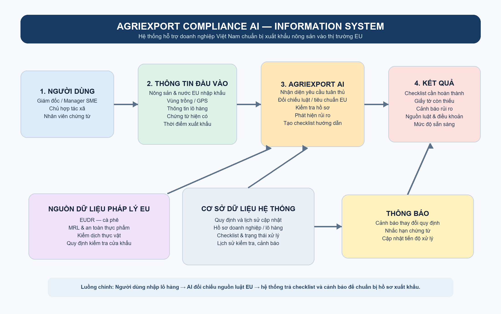
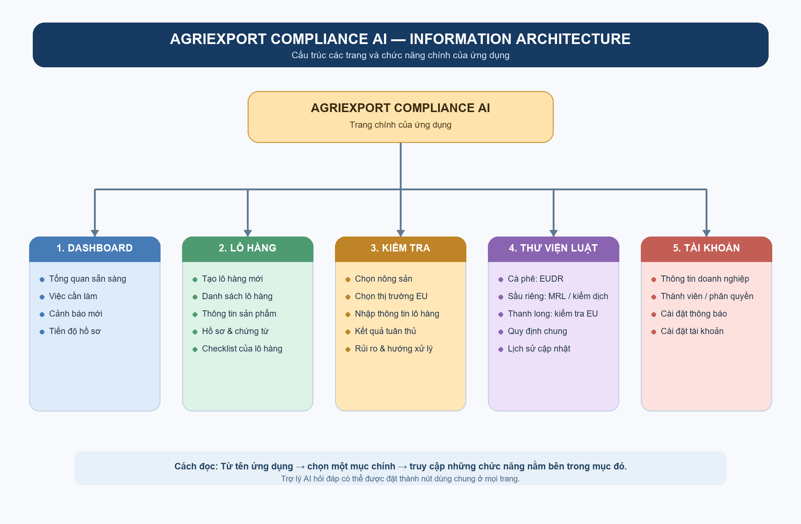

# AgriExport Compliance AI

Bài tập Module 2 – Product Design & Frontend.

AgriExport Compliance AI là ý tưởng ứng dụng hỗ trợ doanh nghiệp Việt Nam chuẩn bị hồ sơ xuất khẩu cà phê, sầu riêng và thanh long vào thị trường EU. Hệ thống hướng tới việc tổng hợp yêu cầu tuân thủ, cảnh báo rủi ro và tạo checklist chuẩn bị hồ sơ.

## Deliverables

- **Information System:** mô tả dữ liệu đầu vào, nguồn luật EU, AI xử lý, cơ sở dữ liệu và kết quả trả về.
- **Information Architecture:** mô tả cấu trúc các trang và chức năng chính của ứng dụng.

## Sơ đồ

### Information System

### Information Architecture

## Phạm vi ban đầu

- Nông sản: cà phê, sầu riêng, thanh long.
- Thị trường: Liên minh châu Âu (EU).
- Người dùng: doanh nghiệp SME, hợp tác xã nông nghiệp và nhân viên phụ trách chứng từ xuất nhập khẩu.
